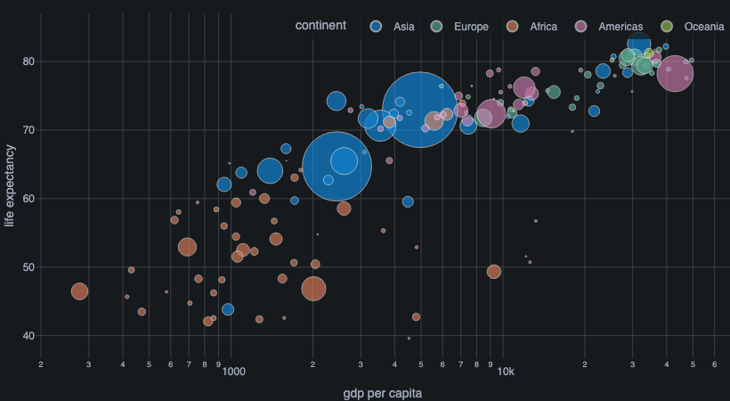
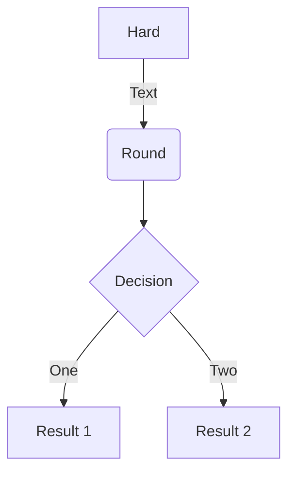
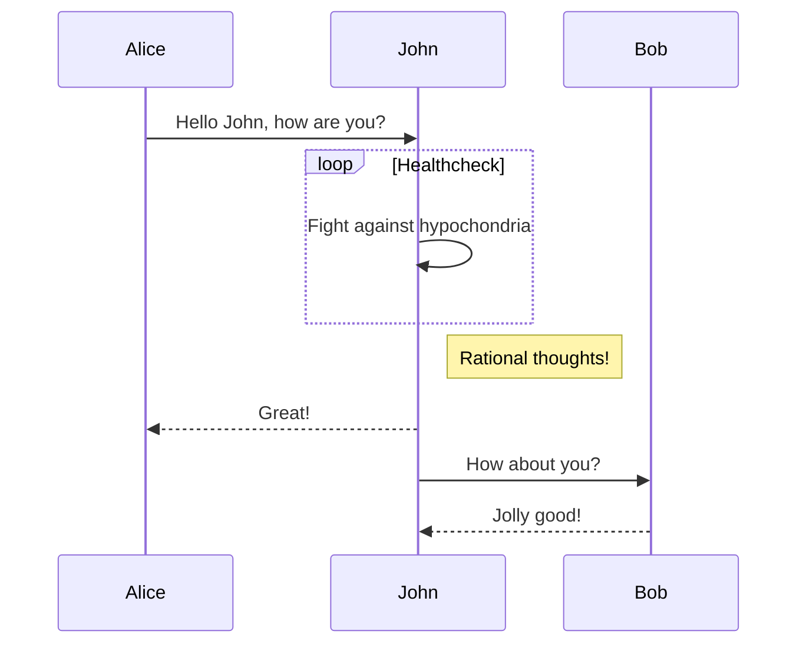
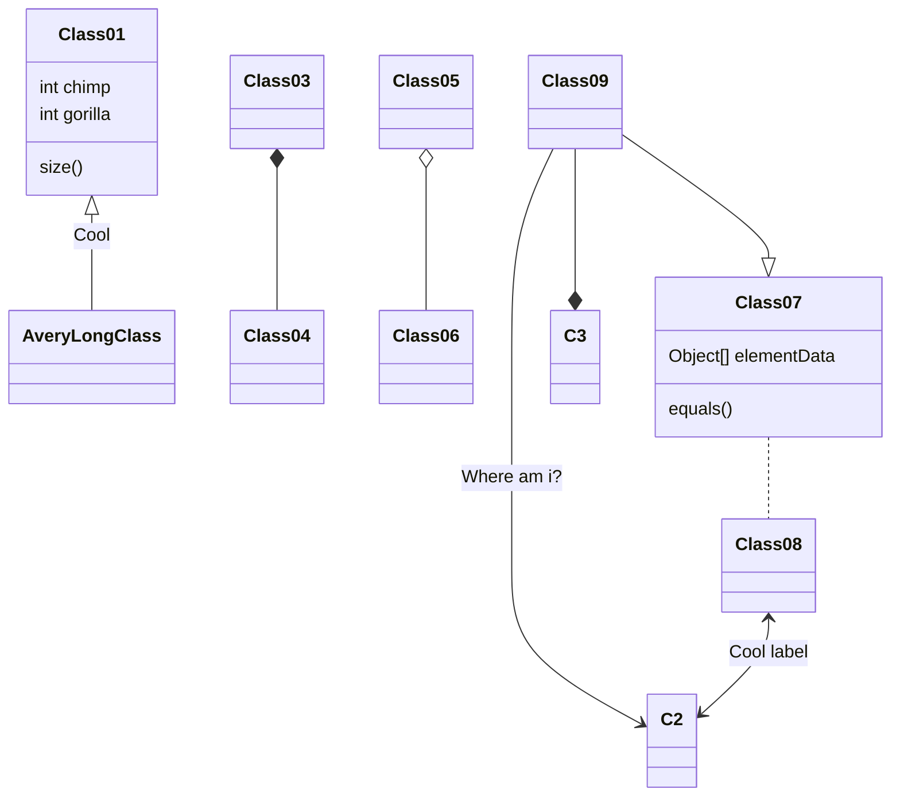
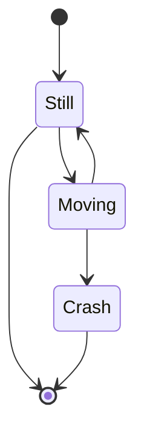

## Charts


```python
# Run this app with `python app.py` and
# visit http://127.0.0.1:8050/ in your web browser.


from dash import Dash, dcc, html
import plotly.express as px
import pandas as pd


app = Dash()

df = pd.read_csv('https://gist.githubusercontent.com/chriddyp/5d1ea79569ed194d432e56108a04d188/raw/a9f9e8076b837d541398e999dcbac2b2826a81f8/gdp-life-exp-2007.csv')

fig = px.scatter(df, x="gdp per capita", y="life expectancy",
                 size="population", color="continent", hover_name="country",
                 log_x=True, size_max=60)

app.layout = html.Div([
    dcc.Graph(
        id='life-exp-vs-gdp',
        figure=fig
    )
])

if __name__ == '__main__':
    app.run(debug=True)
```




Hugo Blox supports the popular [Plotly](https://plot.ly/) format for interactive data visualizations. With Plotly, you can design almost any kind of visualization you can imagine!

Save your Plotly JSON in your page folder, for example `line-chart.json`, and then add the `` shortcode where you would like the chart to appear.

Demo:




You might also find the [Plotly JSON Editor](http://plotly-json-editor.getforge.io/) useful.


<!--

-->


## Go Syntax highlight

```go {linenos=inline hl_lines=[3,"6-8"] style=emacs}
package main

import "fmt"

func main() {
    for i := 0; i < 3; i++ {
        fmt.Println("Value of i:", i)
    }
}
```



\documentclass[11pt,usenames,dvipsnames]{beamer}
\usetheme{CambridgeUS}
\usecolortheme{dolphin}






## Diagrams

Hugo Blox supports the _Mermaid_ Markdown extension for diagrams.

An example **flowchart**:

    ```mermaid
    graph TD
    A[Hard] -->|Text| B(Round)
    B --> C{Decision}
    C -->|One| D[Result 1]
    C -->|Two| E[Result 2]
    ```

renders as



An example **sequence diagram**:

    ```mermaid
    sequenceDiagram
    Alice->>John: Hello John, how are you?
    loop Healthcheck
        John->>John: Fight against hypochondria
    end
    Note right of John: Rational thoughts!
    John-->>Alice: Great!
    John->>Bob: How about you?
    Bob-->>John: Jolly good!
    ```

renders as



An example **class diagram**:

    ```mermaid
    classDiagram
    Class01 <|-- AveryLongClass : Cool
    Class03 *-- Class04
    Class05 o-- Class06
    Class07 .. Class08
    Class09 --> C2 : Where am i?
    Class09 --* C3
    Class09 --|> Class07
    Class07 : equals()
    Class07 : Object[] elementData
    Class01 : size()
    Class01 : int chimp
    Class01 : int gorilla
    Class08 <--> C2: Cool label
    ```

renders as



An example **state diagram**:

    ```mermaid
    stateDiagram
    [*] --> Still
    Still --> [*]
    Still --> Moving
    Moving --> Still
    Moving --> Crash
    Crash --> [*]
    ```

renders as



## Data Frames

Save your spreadsheet as a CSV file in your page's folder and then render it by adding the _Table_ shortcode to your page:

```go

```

renders as



---

```markdown
---
title: "Data Science Visualization Techniques"
date: 2025-02-13
author: "Your Name"
categories: ["Data Science", "Visualization"]
tags: ["Data Visualization", "Machine Learning", "Python", "Matplotlib"]
draft: false
summary: "An exploration of data science visualization techniques to help data scientists communicate insights effectively."
math: true
---

# Introduction

In the world of data science, **visualization** plays a crucial role in making sense of large datasets and communicating insights effectively. Whether you're a beginner or an experienced data scientist, understanding how to use various visualization techniques is essential for analyzing and presenting data in a clear and intuitive way.

In this post, we'll explore some of the most common **data visualization techniques** used in data science, with examples using **Python** libraries like **Matplotlib**, **Seaborn**, and **Plotly**.

## 1. **Line Plots for Time Series Data**

Line plots are one of the most widely used visualization techniques for time series data. They help track changes over time and can highlight trends, cycles, and anomalies in your dataset.

Here’s an example of a **line plot** using **Matplotlib**:

```python
import matplotlib.pyplot as plt
import pandas as pd

# Sample time series data
data = pd.Series([1, 2, 4, 8, 16, 32, 64], index=pd.date_range('2025-01-01', periods=7))

# Line plot
plt.figure(figsize=(10, 6))
plt.plot(data, marker='o', linestyle='-', color='b')
plt.title('Exponential Growth Over Time')
plt.xlabel('Date')
plt.ylabel('Value')
plt.grid(True)
plt.show()
```

**Explanation**: This plot shows how a dataset grows exponentially over time, which is useful for analyzing trends and predicting future values.

## 2. **Scatter Plots for Relationship Between Variables**

Scatter plots are helpful for visualizing the relationship between two continuous variables. They allow you to detect patterns, correlations, and outliers.

Here’s an example of a **scatter plot** using **Seaborn**:

```python
import seaborn as sns

# Sample data
tips = sns.load_dataset('tips')

# Scatter plot
plt.figure(figsize=(8, 6))
sns.scatterplot(x='total_bill', y='tip', data=tips, hue='sex', style='time')
plt.title('Relationship Between Total Bill and Tip')
plt.xlabel('Total Bill')
plt.ylabel('Tip')
plt.show()
```

**Explanation**: This scatter plot shows the relationship between the total bill and the tip, with points differentiated by gender and time of day. You can easily spot patterns and outliers in the data.

## 3. **Bar Plots for Categorical Data**

Bar plots are used to compare quantities across different categories. They can be horizontal or vertical and are perfect for showing the distribution of a categorical variable.

Here’s an example of a **bar plot** using **Seaborn**:

```python
# Bar plot
plt.figure(figsize=(10, 6))
sns.barplot(x='day', y='total_bill', data=tips, estimator=sum)
plt.title('Total Bill Sum for Each Day of the Week')
plt.xlabel('Day')
plt.ylabel('Total Bill Sum')
plt.show()
```

**Explanation**: This bar plot shows the total bill sum for each day of the week in the dataset. It provides a clear visual comparison across categories.

## 4. **Heatmaps for Correlation Matrices**

Heatmaps are perfect for visualizing complex datasets, especially when working with correlation matrices. They help you identify the strength of relationships between multiple variables at a glance.

Here’s an example of a **heatmap** using **Seaborn**:

```python
# Correlation heatmap
corr = tips.corr()

plt.figure(figsize=(8, 6))
sns.heatmap(corr, annot=True, cmap='coolwarm', vmin=-1, vmax=1)
plt.title('Correlation Matrix Heatmap')
plt.show()
```

**Explanation**: This heatmap visualizes the correlation matrix of numerical features in the `tips` dataset, helping you identify which variables are strongly correlated.

## 5. **Interactive Plots with Plotly**

Sometimes static plots aren’t enough, especially for large datasets or when you want users to explore data interactively. **Plotly** provides interactive plotting capabilities to zoom, hover, and filter data.

Here’s an example of an **interactive scatter plot** using **Plotly**:

```python
import plotly.express as px

# Interactive scatter plot
fig = px.scatter(tips, x='total_bill', y='tip', color='sex', hover_data=['day', 'time'])
fig.update_layout(title='Interactive Scatter Plot')
fig.show()
```

**Explanation**: This Plotly scatter plot allows users to interact with the data, hover over points for additional information, and visualize the relationship between `total_bill` and `tip`.

## Conclusion

Data visualization is an essential skill for any data scientist. By using these visualization techniques, you can not only make your data more understandable but also effectively communicate your findings to stakeholders. Whether you're using simple line plots, scatter plots, or advanced interactive visualizations, the goal is to make your insights as clear and actionable as possible.

If you'd like to explore more data visualization techniques or need help with specific visualizations, feel free to reach out in the comments below.

Happy visualizing!

---

**Note**: To display this post correctly, make sure your Hugo site is properly set up with the **Academic theme** and necessary libraries (like **Matplotlib**, **Seaborn**, and **Plotly**) installed.


### How to Use This Content:
1. **Save the file**: Copy the above content into a Markdown file (`.md`), e.g., `data-science-visualization-techniques.md`.
2. **Place it in your Hugo site**: Add the file in the appropriate folder, such as `/content/post/` or `/content/blog/`, depending on your Hugo structure.
3. **Ensure dependencies**: Install any required Python libraries (like Matplotlib, Seaborn, Plotly) on your server if you want the code snippets to run correctly.

This example will allow you to display data science visualizations in an academic, blog-style post using Hugo. Let me know if you'd like further customization!


## Did you find this page helpful? Consider sharing it 🙌
