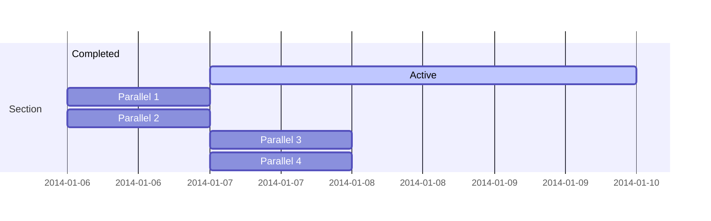

Easily manage your projects - create ideation mind maps, Gantt charts, todo lists, and more!

## Ideation

Hugo Blox supports a Markdown extension for mindmaps.

Simply insert a Markdown code block labelled as `markmap` and optionally set the height of the mindmap as shown in the example below.

Mindmaps can be created by simply writing the items as a Markdown list within the `markmap` code block, indenting each item to create as many sub-levels as you need:

<div class="highlight">
<pre class="chroma">
<code>
```markmap {height="200px"}
- Hugo Modules
  - Hugo Blox
  - blox-plugins-netlify
  - blox-plugins-netlify-cms
  - blox-plugins-reveal
```
</code>
</pre>
</div>

renders as

```markmap {height="200px"}
- Hugo Modules
  - Hugo Blox
  - blox-plugins-netlify
  - blox-plugins-netlify-cms
  - blox-plugins-reveal
```

## Diagrams

Hugo Blox supports the _Mermaid_ Markdown extension for diagrams.

An example **Gantt diagram**:

    ```mermaid
    gantt
    section Section
    Completed :done,    des1, 2014-01-06,2014-01-08
    Active        :active,  des2, 2014-01-07, 3d
    Parallel 1   :         des3, after des1, 1d
    Parallel 2   :         des4, after des1, 1d
    Parallel 3   :         des5, after des3, 1d
    Parallel 4   :         des6, after des4, 1d
    ```

renders as



## Todo lists

You can even write your todo lists in Markdown too:

```markdown
- [x] Write math example
  - [x] Write diagram example
- [ ] Do something else
```

renders as

- [x] Write math example
  - [x] Write diagram example
- [ ] Do something else


Here's an example of how you can write a blog post using Hugo Academic and include examples demonstrating **TaskJuggler** project management. I'll walk you through creating a blog post template for this.

### 1. **Install Hugo and Academic Theme**

Make sure you have Hugo and the Hugo Academic theme installed. You can follow the installation steps from [Hugo's official documentation](https://gohugo.io/getting-started/installing/) and [Hugo Academic theme](https://sourcethemes.com/academic/docs/installation/).

### 2. **Create a New Blog Post**

Once Hugo is set up, create a new blog post using the following command:

```bash
hugo new blog/taskjuggler-project-management.md
```

This will create a new markdown file in the `content/blog` directory. The `taskjuggler-project-management.md` file will be created.

### 3. **Add Content for the Blog Post**

Edit the markdown file (`content/blog/taskjuggler-project-management.md`) to include the following content:

```markdown
---
title: "TaskJuggler Project Management: A Comprehensive Guide"
author: "Your Name"
date: 2025-02-13
tags:
  - project management
  - TaskJuggler
  - productivity
categories:
  - Productivity
type: post
featured_image: "images/taskjuggler.png"
---

# Introduction to TaskJuggler Project Management

TaskJuggler is a powerful, open-source project management tool that can help you plan, track, and execute complex projects. Unlike traditional project management tools with graphical user interfaces (GUIs), TaskJuggler is a text-based system that offers a flexible and highly detailed way to manage tasks, resources, and timelines.

In this blog post, we will explore how to use TaskJuggler for managing a project from start to finish, including practical examples to help you get started.

## Why Use TaskJuggler?

TaskJuggler offers several unique advantages:

- **Text-based**: Unlike most project management tools that rely on graphical interfaces, TaskJuggler uses plain text files, making it lightweight and flexible.
- **Highly Detailed**: You can define tasks, milestones, dependencies, and resources in a very granular way.
- **Open Source**: It is free and open-source, meaning you have full control over your project management setup.

## TaskJuggler Basics

### Installation

To install TaskJuggler on your system, you can use the following commands based on your operating system:

#### On Linux (Debian/Ubuntu):
```bash
sudo apt install taskjuggler
```

#### On macOS (using Homebrew):
```bash
brew install taskjuggler
```

### Creating a Simple TaskJuggler File

TaskJuggler project files are written in a plain text format, often saved with the `.tkl` extension. Below is an example of a simple project file:

```text
project "Website Redesign" 2025-02-01 to 2025-04-01

task "Design" starts 2025-02-01 duration 10d
  depends "Research"

task "Research" starts 2025-02-01 duration 5d

task "Development" starts 2025-02-11 duration 20d
  depends "Design"

task "Testing" starts 2025-02-21 duration 5d
  depends "Development"

resource "John" type "developer"
resource "Sara" type "designer"

assign "John" to "Development"
assign "Sara" to "Design"
```

### Explanation:
- **Project Declaration**: The project is named "Website Redesign" and runs from February 1, 2025, to April 1, 2025.
- **Tasks**: The project consists of four tasks: Research, Design, Development, and Testing. Each task has a start date, duration, and dependencies.
- **Resources**: Two resources (team members) are defined: John (a developer) and Sara (a designer). The `assign` statement assigns each person to the relevant tasks.

### Generating the Project Plan

Once the `.tkl` file is created, you can generate a detailed project report with the following command:

```bash
tj3 project.tkl
```

This will output a Gantt chart, project schedule, and resource utilization summary. TaskJuggler also supports exporting reports in multiple formats, including HTML, PDF, and more.

## Advanced TaskJuggler Features

TaskJuggler allows you to define more complex project scenarios. Here are some advanced features:

### Task Dependencies and Milestones

You can set specific relationships between tasks and milestones to control the flow of the project. For example:

```text
milestone "Project Complete" after "Testing"
```

This ensures that the "Project Complete" milestone will only be triggered once the "Testing" task is finished.

### Resource Management

TaskJuggler helps manage resources efficiently. For instance, you can define working hours and allocate tasks based on resource availability:

```text
resource "John" type "developer" working_hours 40h/week
assign "John" to "Development" from 2025-02-11 to 2025-02-25
```

### Handling Constraints

TaskJuggler supports time and resource constraints, helping you adjust schedules when there are delays or changes:

```text
constraint "Design" start no_earlier_than 2025-02-10
```

This ensures that the "Design" task cannot start before February 10, 2025.

## Conclusion

TaskJuggler is a highly flexible project management tool that can handle a wide range of project types, from simple to complex. By using plain text files to define tasks, resources, and dependencies, it offers a unique, customizable alternative to GUI-based project management tools.

In this blog post, we explored the basics of TaskJuggler, including installation, project setup, and how to generate project reports. We also touched on some advanced features, such as task dependencies, resource management, and constraints.

Whether you're a freelancer managing small projects or part of a large team working on complex endeavors, TaskJuggler can help you stay on track and manage your projects efficiently.

If you want to learn more, visit the [TaskJuggler official website](https://www.taskjuggler.org/).

---

If you're using Hugo Academic for your website, the layout and structure of your blog posts are automatically handled by the theme. You can customize the appearance and features by editing the theme's `config.toml` and adjusting the blog content as needed.

Feel free to reach out with any questions or comments!
```

### 4. **Customize Your Hugo Academic Site**

After adding the blog content, customize the appearance, and modify the theme settings in the `config.toml` file if necessary. You can also include additional resources, links, and tags.

For example, you can add the `featured_image` in the front matter of the post and customize any additional details like the color scheme, fonts, and layout by modifying the `config.toml` or `config.yaml`.

### 5. **Run Your Hugo Site**

Run Hugo locally to see how your blog post looks:

```bash
hugo server
```

This will build your site and serve it at `http://localhost:1313`. Check your post under the `/blog/` section.

---


## Did you find this page helpful? Consider sharing it 🙌
