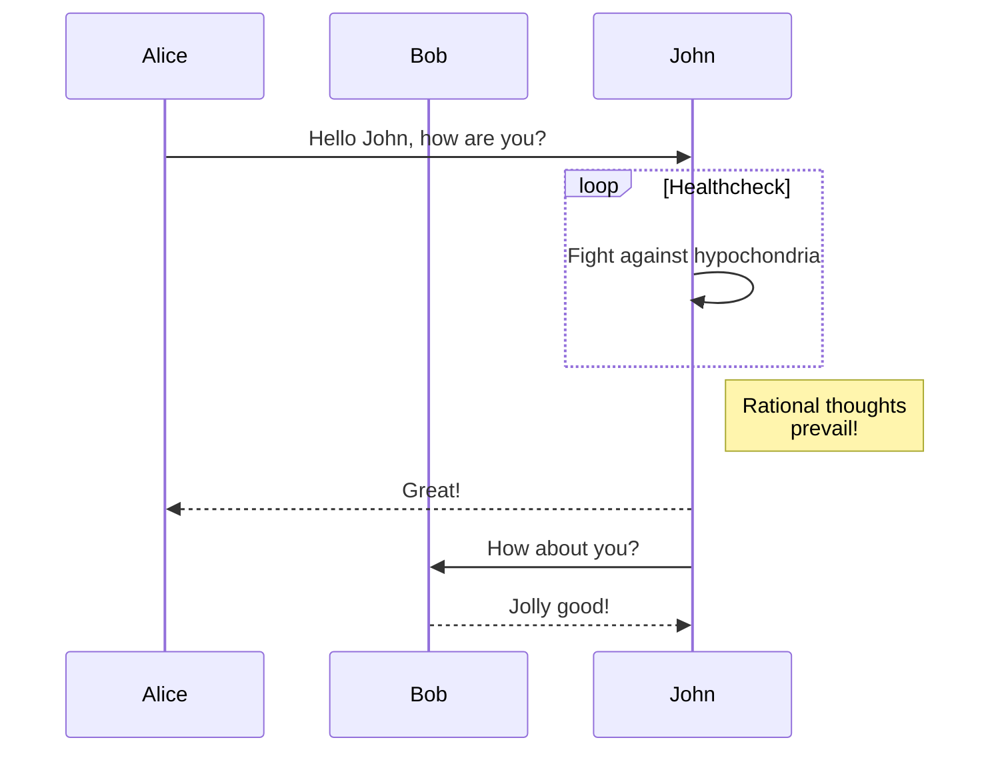

+++
title = "Students"
author = ["Armstrong Foundjem"]
draft = false
+++
The followings are list of students that I mentor at Polytechnique Montreal

Ph.D Students:
-
+  Moses Openja
+  Yang Liu
+  Mina Taraghi
+  Gianolli Dorcelus
+  Paulina Stevia
+  Patrick Foalem
+  Laila Abodinar

M.A.Sc. Students:
-
+ Khouloud Oueslati
+  Dave Mbiazi


Alumni:
-
+ BSc.
  +  Yabo Ling -- Summer intern (July - Sept 2018).

+ Ph.D.  
  

+ M.A.Sc.


```bash {class="my-class" id="my-codeblock" lineNos=inline tabWidth=2}
declare a=1
echo "$a"
exit
```


