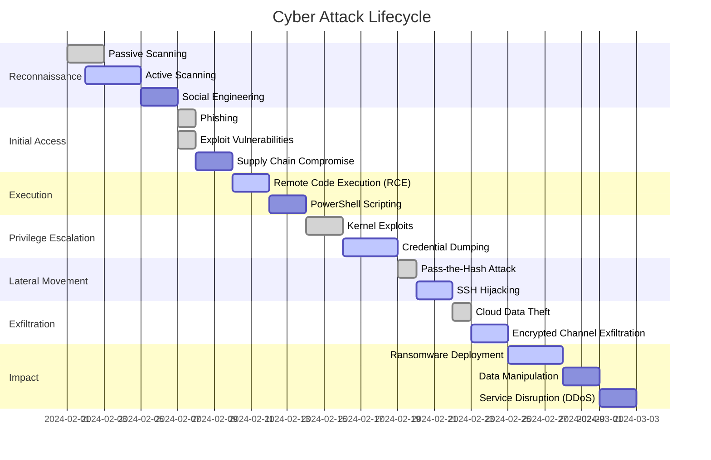

- Key cloud computing concepts. Dependability and security in the cloud. Identity and access management. Secure configuration management. Data protection and automation. Networking and logging. Compliance,
incident response and penetration testing. Security in mobile cloud environments.

## Lecture Notes 📚 INF8102


📥 **Download PDF**
📂 [Lec-1-1](slides/Lec-1-1-Intro_Infonuagique.pdf), [Lec-1-2](slides/Lec-1-2-Intro_Infonuagique.pdf), [Lec-2-1](slides/Lec-2-1-Gestion_Identite_Acces.pdf),..., [Lec-2-2](slides/Lec-2-2-Gestion_Identite_Acces.pdf), [Lec-3-1](slides/Lec-3-1-Gestion_Configuration.pdf),...,[Lec-3-2](slides/Lec-3-2-Security_Configuration.pdf)


## Models

### **Complex Mathematical Model for Cloud Security**

Cloud security involves multiple interdependent components, including **identity management, data protection, access control, compliance, threat detection, and incident response**. To mathematically model cloud security, we integrate **probability theory, queuing models, differential equations, and Markov processes** to analyze attack surfaces, defense mechanisms, and system reliability.

---

## **1. Notation and Key Parameters**
Define the variables used in the model:

| Symbol  | Definition |
|---------|------------|
| \( A(t) \) | Rate of incoming access requests (authentication, API calls, etc.) at time \( t \) |
| \( P_{\text{auth}} \) | Probability of a user successfully authenticating |
| \( T_{\text{auth}} \) | Authentication processing time |
| \( \lambda_{\text{attack}} \) | Rate of attack attempts (DDoS, brute force, SQL injection, etc.) |
| \( P_{\text{detect}} \) | Probability of an attack being detected |
| \( P_{\text{mitigate}} \) | Probability of mitigation succeeding |
| \( C_{\text{data}} \) | Data confidentiality level (measured in entropy) |
| \( P_{\text{leak}} \) | Probability of a data breach |
| \( R_{\text{comp}} \) | Compliance risk score |
| \( U_{\text{log}} \) | Utilization of logging infrastructure |
| \( X_{\text{log}} \) | Log analysis throughput |
| \( S_{\text{cloud}} \) | Overall cloud security risk level |
| \( R_{\text{resp}}(t) \) | Response time to an incident at time \( t \) |

---

## **2. Identity and Access Management (IAM) Model**
IAM enforces security by authenticating and authorizing users.

### **Authentication Model**
We model authentication as a **queuing system**:

\[
R_{\text{auth}} = T_{\text{auth}} + \frac{A(t)}{\mu_{\text{auth}} - A(t)}
\]

where:
- \( \mu_{\text{auth}} \) is the max authentication processing capacity.
- \( R_{\text{auth}} \) is the expected authentication response time.
- **Security constraint**: If \( A(t) > \mu_{\text{auth}} \), authentication requests queue up, increasing attack surface.

### **Attack Detection Probability**
\[
P_{\text{detect}} = 1 - e^{-\beta \lambda_{\text{attack}}}
\]

where:
- \( \beta \) is the detection efficiency of intrusion detection systems (IDS).
- \( \lambda_{\text{attack}} \) is the attack arrival rate.

### **Compromised Sessions**
\[
P_{\text{compromised}} = (1 - P_{\text{auth}}) P_{\text{bypass}} + P_{\text{leak}}
\]

where:
- \( P_{\text{bypass}} \) is the probability of bypassing authentication.

---

## **3. Secure Configuration Management**
Cloud configurations must be dynamically updated to prevent misconfigurations.

### **Configuration Drift Model**
Define **drift rate** \( D(t) \), which represents the deviation of configurations from secure baselines.

\[
\frac{dD(t)}{dt} = \alpha \cdot (1 - P_{\text{secure}}) - \gamma D(t)
\]

where:
- \( \alpha \) is the misconfiguration rate.
- \( P_{\text{secure}} \) is the probability that an update maintains security.
- \( \gamma \) is the rate of security patching.

At equilibrium (\( dD/dt = 0 \)):

\[
D_{\text{eq}} = \frac{\alpha (1 - P_{\text{secure}})}{\gamma}
\]

Security **degrades** if \( \alpha \) is high and \( \gamma \) is low.

---

## **4. Data Protection and Encryption Model**
### **Data Breach Probability**
The probability of a data breach is modeled using **Shannon entropy**:

\[
P_{\text{leak}} = 1 - e^{-\eta C_{\text{data}}}
\]

where:
- \( C_{\text{data}} \) is the entropy (higher means better encryption).
- \( \eta \) is the effectiveness of encryption.

### **Data Loss Rate**
\[
L_{\text{data}}(t) = \lambda_{\text{attack}} (1 - P_{\text{mitigate}}) S_{\text{impact}}
\]

where:
- \( S_{\text{impact}} \) represents the impact of a breach.

---

## **5. Network Security and Log Analysis**
Security logs must be processed efficiently to detect threats.

### **Queuing Model for Log Processing**
Security logs are generated at a rate \( \lambda_{\text{log}} \) and analyzed at \( \mu_{\text{log}} \).

**Log processing delay**:
\[
R_{\text{log}} = \frac{1}{\mu_{\text{log}} - \lambda_{\text{log}}}
\]

If \( \lambda_{\text{log}} > \mu_{\text{log}} \), logs accumulate, **delaying threat detection**.

**Utilization of logging infrastructure**:
\[
U_{\text{log}} = \frac{\lambda_{\text{log}}}{\mu_{\text{log}}}
\]

If \( U_{\text{log}} \approx 1 \), log analysis is overloaded, leading to security blind spots.

---

## **6. Compliance and Risk Management**
Cloud environments must comply with regulatory standards.

### **Compliance Risk Score**
\[
R_{\text{comp}} = \sum_{i=1}^{N} w_i P_{\text{non-compliance}, i}
\]

where:
- \( w_i \) is the weight of compliance factor \( i \).
- \( P_{\text{non-compliance}, i} \) is the probability of violating compliance rule \( i \).

A **high \( R_{\text{comp}} \)** increases legal and reputational risks.

---

## **7. Incident Response Time Model**
\[
R_{\text{resp}}(t) = T_{\text{detect}} + T_{\text{analysis}} + T_{\text{mitigation}}
\]

where:
- \( T_{\text{detect}} \) is the attack detection time.
- \( T_{\text{analysis}} \) is the investigation time.
- \( T_{\text{mitigation}} \) is the response execution time.

**Probability of a successful response**:
\[
P_{\text{success}} = P_{\text{detect}} \cdot P_{\text{analysis}} \cdot P_{\text{mitigate}}
\]

---

## **8. Overall Cloud Security Risk Model**
We define **overall cloud security risk** \( S_{\text{cloud}} \) as:

\[
S_{\text{cloud}} = w_1 P_{\text{compromised}} + w_2 P_{\text{leak}} + w_3 U_{\text{log}} + w_4 R_{\text{comp}}
\]

where:
- \( w_1, w_2, w_3, w_4 \) are weights indicating the impact of each component.

A **higher \( S_{\text{cloud}} \) means a more vulnerable cloud system**.

---

## **9. Cloud Security Optimization**
To improve security, we minimize:

\[
\min_{P_{\text{auth}}, P_{\text{mitigate}}, \mu_{\text{log}}} S_{\text{cloud}}
\]

under the constraints:
- \( P_{\text{auth}} \geq 0.95 \) (strict authentication policy)
- \( P_{\text{mitigate}} \geq 0.9 \) (effective mitigation strategy)
- \( U_{\text{log}} \leq 0.8 \) (log analysis utilization limit)

Using **Lagrange multipliers**, we solve for optimal parameters.

---

## **10. Conclusion**
This **complex mathematical model for cloud security** integrates:
- **Queuing theory** for authentication and logging.
- **Markov models** for attack detection and response.
- **Shannon entropy** for data protection.
- **Optimization methods** to minimize risk.

By analyzing **dynamic security risks** mathematically, cloud architects can **optimize security policies, improve resilience, and minimize attack surfaces** effectively.


### **Deep Mathematical Models in Cybersecurity**

Cybersecurity threats evolve continuously, requiring advanced **mathematical models** to analyze attack patterns, detect intrusions, assess risks, and optimize defensive strategies. Below are deep mathematical models used in cybersecurity, covering **intrusion detection, attack modeling, risk assessment, cryptography, and optimization techniques**.

---

## **1. Intrusion Detection System (IDS) Models**
IDS detects anomalous network activities using statistical and machine learning models.

### **1.1 Statistical Anomaly Detection (Markov Chains)**
Network events follow a **Markov process**, where transitions between states represent different network behaviors.

- Let \( X_t \) be the state of the network at time \( t \), where:
  \[
  P(X_{t+1} | X_t, X_{t-1}, \dots, X_0) = P(X_{t+1} | X_t)
  \]
- The transition matrix \( P \) defines the probabilities:
  \[
  P = \begin{bmatrix}
  P_{11} & P_{12} & \cdots & P_{1n} \\
  P_{21} & P_{22} & \cdots & P_{2n} \\
  \vdots & \vdots & \ddots & \vdots \\
  P_{n1} & P_{n2} & \cdots & P_{nn}
  \end{bmatrix}
  \]

- A **deviation score** is computed:
  \[
  S_t = \sum_{i=1}^{n} \left| P(X_{t+1} | X_t) - P_{\text{baseline}}(X_{t+1} | X_t) \right|
  \]
  If \( S_t > \tau \), an anomaly is detected.

---

## **2. Attack Modeling with Game Theory**
Cybersecurity involves **attackers** and **defenders**, making **game theory** an effective tool.

### **2.1 Zero-Sum Attack-Defense Model**
- The attacker aims to maximize damage \( A \), while the defender minimizes loss \( D \).
- Define a **payoff function**:
  \[
  U(A, D) = - C(A) + B(A, D) - P(D) C(D)
  \]
  where:
  - \( C(A) \) = attack cost,
  - \( B(A, D) \) = benefit to the attacker,
  - \( P(D) \) = probability of detection,
  - \( C(D) \) = cost of defense.

- **Nash Equilibrium**:
  \[
  \frac{\partial U}{\partial A} = 0, \quad \frac{\partial U}{\partial D} = 0
  \]
  solving for \( A^* \), \( D^* \) gives the optimal attack and defense strategies.

---

## **3. Cyber Risk Assessment**
Risk is computed using probability distributions of attack likelihood and impact.

### **3.1 Expected Risk Model**
- Define **risk** as:
  \[
  R = \sum_{i=1}^{n} P(A_i) I(A_i)
  \]
  where:
  - \( P(A_i) \) = probability of attack \( i \),
  - \( I(A_i) \) = impact function.

- **Loss Distribution Function** (Poisson-Gamma model):
  \[
  L(x) = \int_0^x P_{\text{attack}}(\lambda) P_{\text{loss}}(x | \lambda) d\lambda
  \]

where:
- \( P_{\text{attack}}(\lambda) = \frac{\lambda^k e^{-\lambda}}{k!} \) (Poisson distribution of attacks),
- \( P_{\text{loss}}(x | \lambda) = \frac{\beta^\alpha x^{\alpha-1} e^{-\beta x}}{\Gamma(\alpha)} \) (Gamma-distributed loss).

---

## **4. Cryptographic Security Analysis**
Mathematical models ensure encryption strength.

### **4.1 Entropy-Based Key Strength**
Let \( K \) be the cryptographic key space.
- **Entropy** measures unpredictability:
  \[
  H(K) = -\sum_{i=1}^{n} P(k_i) \log_2 P(k_i)
  \]
  Higher entropy implies stronger keys.

- **Brute-force probability**:
  \[
  P_{\text{break}}(t) = 1 - e^{- \frac{t}{T_{\text{search}}}}
  \]
  where \( T_{\text{search}} \) is the time needed to search the key space.

---

## **5. Network Traffic Anomaly Detection**
Anomalous traffic can indicate a cyber attack.

### **5.1 Gaussian Mixture Model (GMM) for Network Behavior**
- Let network traffic be a mixture of normal and attack distributions:
  \[
  P(x) = \sum_{i=1}^{K} w_i \mathcal{N}(x | \mu_i, \Sigma_i)
  \]
  where \( w_i \) are mixture weights, and \( \mathcal{N}(x | \mu_i, \Sigma_i) \) is the Gaussian component.

- The likelihood function is:
  \[
  L = \prod_{i=1}^{N} P(x_i)
  \]

- Use **Expectation-Maximization (EM)** to estimate parameters \( w_i, \mu_i, \Sigma_i \) and classify anomalies.

---

## **6. Cybersecurity Optimization**
### **6.1 Optimizing Security Investments**
- Budgeting security resources is modeled as:
  \[
  \max_{x} U(x) = \sum_{i=1}^{n} P(A_i) \left( I(A_i) - C(x_i) \right)
  \]
  subject to:
  \[
  \sum_{i=1}^{n} x_i \leq B
  \]
  where:
  - \( x_i \) = security investment in attack \( i \),
  - \( C(x_i) \) = cost function,
  - \( B \) = total security budget.

Using **Lagrange multipliers**, the optimal investment satisfies:

\[
\frac{\partial U}{\partial x_i} = \lambda
\]

---

## **7. Botnet Propagation Model**
Botnets spread through networks, modeled as an **epidemic process**.

### **7.1 Compartmental Model (SIS Model)**
\[
\frac{dS}{dt} = -\beta S I + \gamma I
\]

\[
\frac{dI}{dt} = \beta S I - \gamma I
\]

where:
- \( S \) = susceptible systems,
- \( I \) = infected systems,
- \( \beta \) = infection rate,
- \( \gamma \) = recovery rate.

### **7.2 Stability Analysis**
Equilibrium points satisfy:

\[
\frac{dI}{dt} = 0 \Rightarrow I^* = \frac{\beta S^*}{\gamma}
\]
If \( \frac{\beta}{\gamma} > 1 \), the infection spreads.
---

## **8. Malware Detection Using Machine Learning**
Machine learning classifies malware based on feature vectors.

### **8.1 Support Vector Machine (SVM) for Malware Classification**
- Given labeled samples \( (x_i, y_i) \), find a hyperplane:
  \[
  f(x) = w^T x + b
  \]
  that maximizes the margin:
  \[
  \max_{w, b} \frac{1}{||w||} \sum_{i=1}^{n} y_i (w^T x_i + b) \geq 1
  \]

- Solve using **Lagrange multipliers**.

---

## **Conclusion**
Cybersecurity relies on deep mathematical models for:
- **Intrusion detection (Markov Chains, GMM)**
- **Attack modeling (Game Theory)**
- **Risk assessment (Poisson-Gamma models)**
- **Cryptographic strength (Entropy)**
- **Botnet propagation (Epidemic models)**
- **Machine learning-based malware detection (SVM)**

These models help **predict, detect, and mitigate** security threats, ensuring robust cyber defense mechanisms.


## Code

Here is the Python code for **Attack Modeling with Game Theory** and **Intrusion Detection using Markov Chains and Gaussian Mixture Models (GMM)**.

---

### **1. Attack Modeling with Game Theory (Zero-Sum Game)**
We use a **zero-sum game** model where an **attacker** tries to maximize their payoff (damage), while a **defender** minimizes their losses by allocating security resources optimally.

```python
import numpy as np
import nashpy as nash  # Nash equilibrium solver

# Define the payoff matrix for Attacker (rows) vs Defender (columns)
payoff_matrix = np.array([
    [-10, -5, -20],  # Attacker's payoff when defender uses strategies (firewall, monitoring, patching)
    [-5,  -2, -10],
    [-15, -7, -25]
])

# Create the game
game = nash.Game(payoff_matrix)

# Compute Nash equilibria
equilibria = list(game.support_enumeration())

# Display results
print("Nash Equilibria (Mixed Strategies):")
for eq in equilibria:
    print("Attacker Strategy:", eq[0])
    print("Defender Strategy:", eq[1])
```

#### **Explanation:**
- The **payoff matrix** represents the attacker's losses (negative values).
- The **Nash equilibrium** provides the optimal mixed strategies for both **attacker** and **defender**.

---

### **2. Intrusion Detection with Markov Chains**
We model **network states** as a Markov Chain where transitions represent **normal vs anomalous behavior**.

```python
import numpy as np
import matplotlib.pyplot as plt

# Transition Matrix (Normal, Suspicious, Attack)
P = np.array([
    [0.7, 0.2, 0.1],  # Normal state
    [0.3, 0.5, 0.2],  # Suspicious state
    [0.1, 0.3, 0.6]   # Attack state
])

# Initial state probabilities
initial_state = np.array([1, 0, 0])  # Start in normal state

# Simulate 20 steps
num_steps = 20
state_probabilities = [initial_state]

for _ in range(num_steps):
    new_state = state_probabilities[-1] @ P
    state_probabilities.append(new_state)

# Convert results for plotting
state_probabilities = np.array(state_probabilities)

# Plot state evolution over time
plt.figure(figsize=(8, 5))
plt.plot(state_probabilities[:, 0], label="Normal State")
plt.plot(state_probabilities[:, 1], label="Suspicious State")
plt.plot(state_probabilities[:, 2], label="Attack State")
plt.xlabel("Time Steps")
plt.ylabel("Probability")
plt.title("Intrusion Detection Markov Model")
plt.legend()
plt.grid()
plt.show()
```

#### **Explanation:**
- The **transition matrix** defines probabilities of moving between states.
- We compute **state probabilities** over time and plot them.

---

### **3. Intrusion Detection with Gaussian Mixture Model (GMM)**
GMM is used to classify **network traffic anomalies**.

```python
import numpy as np
import matplotlib.pyplot as plt
from sklearn.mixture import GaussianMixture
from sklearn.datasets import make_blobs

# Generate synthetic normal and attack network traffic data
X_normal, _ = make_blobs(n_samples=300, centers=[[5, 5]], cluster_std=1.0, random_state=42)
X_attack, _ = make_blobs(n_samples=100, centers=[[10, 10]], cluster_std=1.5, random_state=42)

# Combine normal and attack data
X = np.vstack((X_normal, X_attack))

# Fit a GMM model (2 clusters: Normal and Attack)
gmm = GaussianMixture(n_components=2, covariance_type='full', random_state=42)
gmm.fit(X)
labels = gmm.predict(X)

# Plot the results
plt.figure(figsize=(8, 5))
plt.scatter(X[:, 0], X[:, 1], c=labels, cmap='coolwarm', edgecolors='k')
plt.xlabel("Feature 1 (e.g., Packet Size)")
plt.ylabel("Feature 2 (e.g., Request Rate)")
plt.title("Intrusion Detection using GMM")
plt.colorbar(label="Cluster (0: Normal, 1: Attack)")
plt.show()
```

#### **Explanation:**
- We generate **synthetic network traffic** data.
- GMM classifies **normal vs attack** behavior.
- The **scatter plot** visualizes network behavior, separating normal vs attack traffic.

---

## **Conclusion**
- **Game Theory**: Models the attack-defense interaction and finds optimal strategies.
- **Markov Chains**: Models system states and predicts anomalies over time.
- **GMM**: Detects anomalies in network traffic.

These models **enhance cybersecurity** by predicting attack strategies, **detecting intrusions**, and **optimizing defensive responses**. 🚀


## Cyber Threat Landscape: Attack Vectors and Methods

```markmap 
- Cyber Attack Model
  - Reconnaissance
    - Passive Scanning
    - Active Scanning
    - Social Engineering
  - Initial Access
    - Phishing
    - Exploit Public-Facing Apps
    - Supply Chain Compromise
  - Execution
    - Remote Code Execution (RCE)
    - PowerShell Scripting
    - Macro-based Attacks
  - Privilege Escalation
    - Kernel Exploits
    - Credential Dumping
    - Bypassing UAC
  - Defense Evasion
    - Obfuscation
    - Rootkits
    - Code Injection
  - Lateral Movement
    - Pass-the-Hash
    - Remote Services Exploitation
    - SSH Hijacking
  - Exfiltration
    - Data Compression
    - Encrypted Channel
    - Cloud Data Theft
  - Impact
    - Ransomware
    - Data Manipulation
    - Service Disruption (DDoS)
  - Advanced Persistent Threats (APT)
    - Nation-State Actors
    - Zero-Day Exploits
    - Supply Chain Attacks
```

### **Explanation:**
- **Reconnaissance**: The attacker gathers intelligence before launching an attack.
- **Initial Access**: How the attacker infiltrates the system (e.g., phishing, exploiting vulnerabilities).
- **Execution**: Running malicious code after gaining access.
- **Privilege Escalation**: Gaining higher permissions to execute more dangerous actions.
- **Defense Evasion**: Hiding attack traces using stealth techniques.
- **Lateral Movement**: Expanding control over the network.
- **Exfiltration**: Stealing sensitive information.
- **Impact**: Consequences like **ransomware**, **DDoS**, or **data manipulation**.
- **APT**: Advanced threats by nation-state actors using **zero-day exploits**.

This **Markmap attack model** gives a clear **visual representation** of how cyber attacks progress in different stages. 🚀


## Cyber Attack Lifecycle: A Time-Based Perspective



### **Explanation:**
- **Reconnaissance**: Attackers gather intelligence before striking.
- **Initial Access**: Attackers infiltrate the system (via phishing, exploits, etc.).
- **Execution**: Malicious code runs (e.g., RCE, scripts).
- **Privilege Escalation**: Attackers gain higher privileges for deeper system control.
- **Lateral Movement**: Attackers expand their reach across the network.
- **Exfiltration**: Data is stolen through encrypted channels.
- **Impact**: Attackers deploy ransomware, manipulate data, or disrupt services.

This **Mermaid Gantt chart** provides a **time-based visualization** of how attacks progress in stages, highlighting **dependencies** between different attack techniques. 🚀

